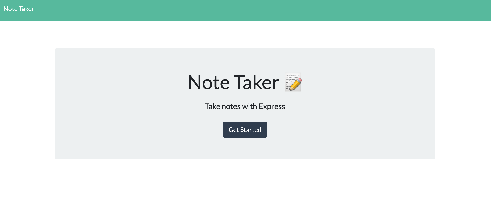
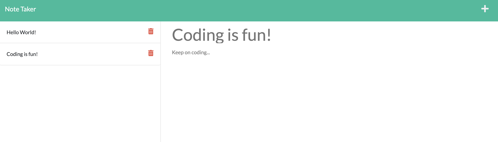

# MT Notebook

MT Notebook is a note-taking application that gives users options to create, save, and delete notes. Using Express.js for backend development, it connects the pre-existing front-end framework to achieve the features in saving and retrieving note data from a JSON file. 

## Getting Started

A Get Started button on the landing page takes users to a note taking page where users can create, save, and delete notes. 
Download the files and install dependencies. On terminal, use "npm i" and then "node server.js".

## Built With

* [Javascript](https://developer.mozilla.org/en-US/docs/Web/JavaScript)
* [Node.js](https://nodejs.org/en/)
* [Express](https://expressjs.com)
* [Heroku](https://heroku.com)

## Deployed Link

* [Link to Heroku](https://hmt-notebook.herokuapp.com/notes)
* [Link to Github](https://github.com/MANDYTSANG007/MT-Notebook)

## Design Layout

## Authors

**Mandy Tsang** 

- [Portfolio](https://mandytsang007.github.io/new-portfolio/)
- [Github](https://github.com/MANDYTSANG007)
- [LinkedIn](https://www.linkedin.com/in/man-tsang-64308b22a/)

## License

This project is licensed under the MIT License 

